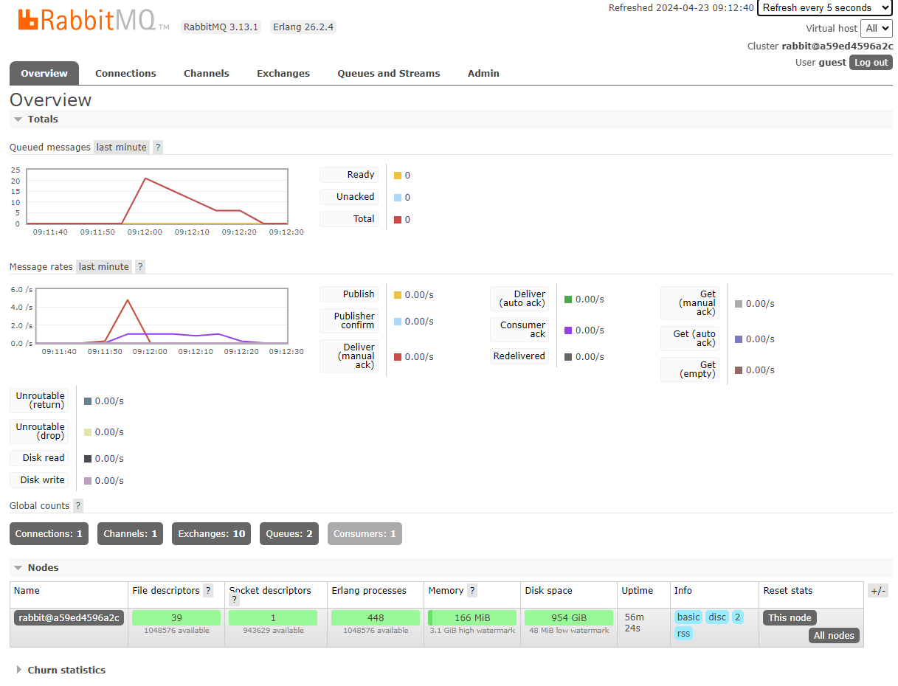
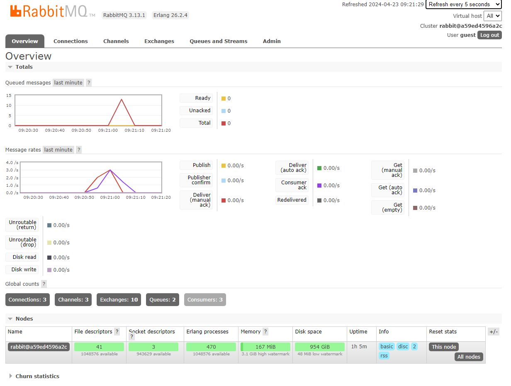
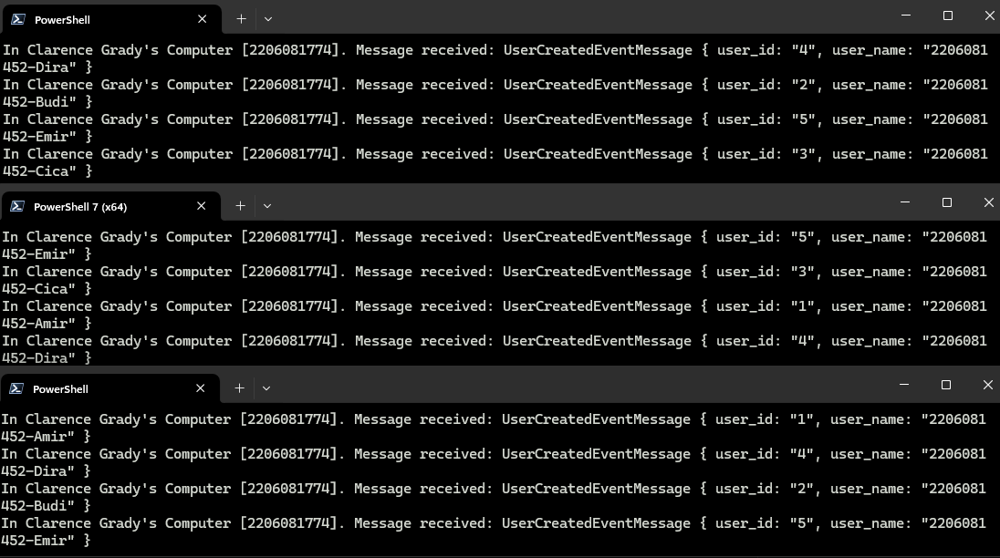

a. what is AMQP?

AMQP, or the Advanced Message Queuing Protocol, is a messaging protocol that enables communication between applications or services. AMQP is designed for systems where high reliability and interoperability are crucial.
 
 
b. guest:guest@localhost:5672

The first guest: This is the username for authentication.
The second guest: This is the password for the above username.
localhost: This is the hostname of the server where the message broker (like RabbitMQ) is running. In this case, it’s running on the same machine as the client.
5672: This is the port number on which the message broker is listening. Port 5672 is the default port for AMQP

the total number is 20 because the publisher has run 4 times and each time it sends 5 data to the queue.

the queue didnt spiked as high as the time when it ran with one subscriber. It means running with 3 subscriber divides the compute power so it has less total queue.
Things to improve the code:
- Error Handling: The unwrap() method is used, which can cause the program to panic if the Result is an Err. It's better to handle these potential errors gracefully.
- Infinite Loop: The main function contains an infinite loop with no break condition or functionality inside. This can lead to high CPU usage.
- Unused Variables: The variables ten_millis and now are declared but not used, which is unnecessary.
- Unimplemented Function: The get_handler_action function is not implemented and just has a todo!() call. This should be implemented or removed if not needed.
- Hardcoded Values: The connection string and queue name are hardcoded. It would be better to move these to a configuration file or environment variables.